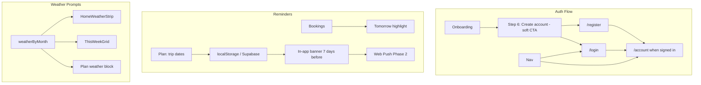

# Auth, Reminders & Weather Prompts — Product Upgrade Plan (v2)

**Status:** Analysis-improved  
**Sources:** PRD, SAAS_BOOKING_EXTENSION, ICPS, UX_PERSONA, TECHNICAL, cyprus-tourism-app SKILL

---

## Executive Summary

Upgrade Cyprus Winter with **login/registration** (onboarding + menu), **reminder system** (trip countdown, booking reminders), and **weather prompts** (contextual tips). All features must align with UX_PERSONA: *understated, discovery-first, Mediterranean warmth. Suggest, don't push.*

---

## 1. UX Persona Alignment (Non-Negotiable)

| Principle | Application |
|-----------|-------------|
| **No long flows** | Onboarding step 6: soft CTA only. First-timer can skip and go straight to Discover/AI. |
| **Suggest, don't push** | Auth: "Save your plan across devices" — benefit-first. Reminders: helpful, not nagging. |
| **Helpful, not pushy** | Weather prompts: "Pack layers for the mountain" — local knowledge, not sales. |
| **Voice** | Short, warm. "Three days until you're here" not "Reminder: Trip in 3 days". |
| **44px touch targets** | Auth forms, reminder banners, weather strip — all min-h-[44px]. |

**Tone reference (ICPS 9.2):** Primary CTA "Plan your winter escape" / "Add to itinerary". Reminder copy: "Your Day 1 plan is ready" (README).

---

## 2. ICP Value Mapping

| ICP | Auth value | Reminder value | Weather value |
|-----|------------|----------------|----------------|
| **Claire (Primary)** | Sync 10–14 day plan, bookings across devices | Trip countdown, "Day 1 ready" before arrival | Weather-responsive suggestions (rain → indoor) |
| **Anders** | Persist trail reports, group hike profile | Trail conditions alerts | "Check summit conditions" for Troodos |
| **Nadia** | Long-stay preferences, coworking saved | Weekend reminder, nomad events | General mild-weather tips |
| **Family** | Family preferences, saved picks | School-holiday trip reminders | "Pack layers" / beach-appropriate |

---

## 3. Auth: Login & Registration

### 3.1 Scope

- **Provider:** Supabase Auth (already in stack; `getSupabaseBrowser()` uses anon key).
- **Methods:** Email + password, magic link (Otp), optional Google OAuth.
- **Persistence:** Link bookings and itinerary to user ID on signup.

### 3.2 Routes

| Route | Purpose | i18n |
|-------|---------|------|
| `/login` | Sign in | Add to routing pathnames (e.g. el: /eisodos, de: /anmelden) |
| `/register` | Sign up | Add to pathnames |
| `/account` | Profile when signed in; redirect to `/login` when not | Already in pathnames |

### 3.3 Onboarding Integration

- **Step 6** in [OnboardingModal.tsx](src/components/OnboardingModal.tsx).
- **Copy (UX_PERSONA):** "Save your plan across devices — create a free account. Or skip and explore."
- **CTAs:** Primary "Create account" → `/register`, Secondary "Sign in" → `/login`, Tertiary "Skip" (same as current).
- **No gate:** User can dismiss without signing up. No forced modal on return.

### 3.4 Menu Integration

- **Nav (desktop) / More (mobile):** Account link behavior:
  - Logged out: label "Account" or "Sign in" → `/login`
  - Logged in: "Account" → `/account` (profile, bookings, plan)
- Use `AuthContext` or `useAuth()` to toggle.

### 3.5 Migration: localStorage → Account

On first login after signup: offer to merge localStorage itinerary and bookings (by email) into account. Single "Import my plan" CTA.

### 3.6 Technical Notes

- `getSupabaseBrowser()` for client auth.
- Server: `getSupabase()` + service role for protected API logic.
- Middleware or server-component check for `/account`; redirect to `/login?redirect=/account`.
- Add `NEXT_PUBLIC_SUPABASE_ANON_KEY` to env (required for auth).
- Auth forms: use `LAYOUT.form`, `CARD.base`, `CTA.primaryCompact` per design tokens.

### 3.7 Error Copy (UX_PERSONA)

- Invalid credentials: "Email or password doesn't match. Try again or reset."
- Network: "Something went wrong. Try again or tap Ask AI for help."

---

## 4. Reminder System

### 4.1 Reminder Types

| Type | Trigger | Delivery | Copy (tone) |
|------|---------|----------|-------------|
| **Trip countdown** | User sets `tripStartDate` in Plan | In-app banner | "Three days until you're here. Your Day 1 plan is ready." |
| **Booking reminder** | Winery booking date = tomorrow | In-app card on Bookings | "Tomorrow: Tsiakkas tasting — directions ready." |
| **Trail conditions** | (Phase 2) Trail status change | Web Push (opt-in) | "Artemis Trail is clear. Good to go." |

### 4.2 Data Model

**Anonymous (localStorage):**

```ts
// Add to Plan page state / useItinerary
tripStartDate?: string;  // ISO date
tripEndDate?: string;    // optional
```

**Authenticated (Supabase `user_preferences` or `profiles`):**

```ts
{
  trip_start_date?: string;
  trip_end_date?: string;
  reminder_trip_countdown: boolean;
  reminder_bookings: boolean;
  push_enabled: boolean;  // Phase 2
}
```

### 4.3 In-App UX

- **Plan page:** Optional "When are you traveling?" date range picker (non-blocking). Persist to localStorage or Supabase.
- **Reminder banner:** Show on home or plan when `tripStartDate` within 7 days. Dismissible.
- **Bookings page:** Highlight tomorrow's bookings with a small banner: "Tomorrow — Tsiakkas Winery".
- **StickyPlanBar / Plan hero:** Pill "3 days until your trip" when within 7 days.

### 4.4 Web Push (Phase 2)

- VAPID keys, service worker.
- Opt-in: "Get trip and trail reminders" on account settings or Plan.
- TECHNICAL.md references Web Push for trail conditions and itinerary reminders.

---

## 5. Weather Prompts

### 5.1 Logic (PRD 3.4 Winter Itinerary)

Map `weatherByMonth` to contextual prompts:

| Month condition | Coast/Troodos | Prompt type | Example |
|-----------------|---------------|-------------|---------|
| Dec–Feb (rain likely) | — | Rain-ready | "Pack a rain layer. Wineries and museums are perfect today." |
| Jan–Feb (ski) | Troodos | Ski/ice | "Troodos ski season — check conditions before heading up." |
| Mar | — | Hiking | "Best hiking month. Trails are open — add a hike to your plan." |
| Cold snap (Jan) | Troodos | Mountain | "Mountain may be icy. Pack microspikes." |

### 5.2 Components to Update

| Component | Change |
|-----------|--------|
| [HomeWeatherStrip.tsx](src/app/_home/HomeWeatherStrip.tsx) | Add prompt line from `weatherByMonth[month].coastDesc` or `troodosDesc` (e.g. "Pack layers for the mountain.") |
| [ThisWeekGrid.tsx](src/app/_home/ThisWeekGrid.tsx) | Dynamic tip from current month |
| Plan page | Optional "Weather tip" block: e.g. "December: mild days, cool nights. Pack layers." |

### 5.3 Prompt Selection

- Pick one prompt per view (avoid overload).
- Prefer actionable: "Check trail conditions" > "Trails may be snowy."
- Use `prose-label` or `text-sage text-sm` for consistency.

### 5.4 Optional: Live Weather API

- Open-Meteo or similar for Larnaca + Troodos.
- Enable "Rain tomorrow — consider indoor options" on Home/Plan.
- Phase 2; requires API key, rate limiting.

---

## 6. Architecture



---

## 7. Implementation Order

| Phase | Scope | Effort |
|-------|-------|--------|
| **1. Auth** | Supabase Auth config → `/login`, `/register` → AuthContext → Nav/Account → Onboarding step 6 → i18n keys | Medium |
| **2. Weather prompts** | HomeWeatherStrip + ThisWeekGrid dynamic tips from weatherByMonth | Low |
| **3. Reminders (in-app)** | Plan trip date picker (localStorage) → banner 7 days before → Bookings tomorrow card | Medium |
| **4. Auth sync** | Merge itinerary/bookings on first login | Low |
| **5. Web Push** | VAPID, service worker, opt-in, trip/booking/trail push | Phase 2 |

---

## 8. Key Files

| File | Action |
|------|--------|
| `src/app/login/page.tsx` | New — login form (email/password, magic link, Google) |
| `src/app/register/page.tsx` | New — signup form |
| `src/app/account/page.tsx` | Replace placeholder with profile; redirect when not signed in |
| `src/components/OnboardingModal.tsx` | Add step 6 with soft CTA |
| `src/components/Nav.tsx` | Account → Sign in or Account based on session |
| `src/components/BottomNav.tsx` | Same for More dropdown |
| `src/contexts/AuthContext.tsx` | New — session, user, signIn, signOut |
| `src/app/_home/HomeWeatherStrip.tsx` | Add contextual prompt line |
| `src/app/_home/ThisWeekGrid.tsx` | Dynamic weather tip |
| `src/app/plan/page.tsx` | Trip date picker, reminder banner/pill |
| `src/app/bookings/page.tsx` | "Tomorrow" highlight for next-day bookings |
| `src/i18n/routing.ts` | Add `/login`, `/register` pathnames |
| `messages/en.json` (and el, de, pl) | Auth, reminder, weather strings |

---

## 9. Dependencies

- **Supabase Auth:** Enable in Supabase dashboard; configure email templates, Google OAuth if desired.
- **Env:** `NEXT_PUBLIC_SUPABASE_ANON_KEY` (in addition to existing service role).
- **No new npm packages** for Phase 1 (auth, weather, in-app reminders).

---

## 10. Risks & Mitigations

| Risk | Mitigation |
|------|------------|
| Onboarding feels pushy | Step 6 is last; prominent "Skip" / "Get started" without forcing signup |
| Auth blocks core flows | Bookings and plan remain usable without account; auth unlocks sync |
| Reminders feel spammy | In-app only first; copy warm and contextual; dismissible banner |
| i18n gaps | Add auth/reminder/weather keys to all 4 locales from day one |

---

## 11. Success Criteria

- [ ] First-time user can skip onboarding and explore without account
- [ ] Signed-in user sees plan/bookings in Account; can sync from localStorage on first login
- [ ] Trip date in Plan shows reminder banner within 7 days
- [ ] Tomorrow's booking highlighted on Bookings page
- [ ] HomeWeatherStrip shows month-appropriate prompt (e.g. "Pack layers for the mountain")
- [ ] All copy matches UX_PERSONA: short, warm, helpful, not pushy
