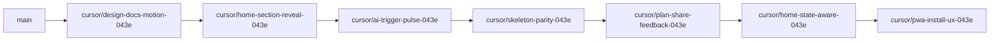

# Design Super Brief — Implementation Plan

## Goal

Operationalize the design super brief (visual language, motion philosophy, UX polish scorecard) into **shippable, reviewable PRs** on `main`, without a rebrand or scope creep into ops/legal/photo acquisition.

**North star (unchanged):** *Quiet premium winter field guide — calm motion, terracotta confidence, discovery-first.*

---

## Prerequisites

- Branch from latest `main` (resolve any open train first, e.g. [#135](https://github.com/G9MaGiC/cyprus-winter/pull/135) loading skeletons if still open).
- Branch naming: `cursor/<descriptive-name>-043e` (lowercase, suffix `-043e`).
- Each PR: **one user-visible theme**; avoid mixing docs + home refactor + PWA in one diff.

---

## GitHub / merge train best practices

| Rule | Why |
|------|-----|
| **Draft PR on first push** | Triggers CI early; use ManagePullRequest (not `gh pr create` from agents). |
| **Mark ready only when green** | Quality, Build, Core Funnel Gate, E2E Full must pass before FF-merge. |
| **FF-merge to `main`** | `git merge --ff-only` — keeps linear history like recent trains (#122–#135). |
| **One BUG ID per PR** | Log in [`docs/QA_BUGS.md`](docs/QA_BUGS.md) as BUG-246+. |
| **Verification block in PR body** | Paste command results (lint, typecheck, test count, i18n, build; E2E if funnel/overlays). |
| **E2E gate when touching** | Home, plan, discover, overlays, hub footers → `npm run test:e2e:gate:ci`. |
| **i18n gate when adding copy** | New user strings → all 7 locales + `npm run i18n:scan --fail`. |
| **Guard tests for motion** | Follow [`src/lib/dr-leftover-polish.test.ts`](src/lib/dr-leftover-polish.test.ts) pattern (Discover already guards `section-reveal`). |
| **`prefers-reduced-motion`** | Any new animation must mirror [`globals.css`](src/app/globals.css) lines 61–72 and 196–207. |
| **No conflict markers** | CI runs `npm run check:conflict-markers` — never commit `<<<<<<<` in QA_BUGS. |
| **Conventional commits** | `docs:`, `fix(ux):`, `feat(ux):` — match recent history. |
| **Link design docs in PR** | Reviewers anchor to MOTION.md / UX_PATTERNS section. |



**Recommended merge order:** Docs → motion quick wins (can parallelize b1+b2 after b0) → skeletons → share feedback → state-aware home → PWA (optional last).

---

## Phase 0 — Design system documentation (foundation)

**Branch:** `cursor/design-docs-motion-043e`  
**BUG:** BUG-246  
**Risk:** None (docs only)

### Deliverables

| File | Content |
|------|---------|
| [`docs/DESIGN_SUPER_BRIEF.md`](docs/DESIGN_SUPER_BRIEF.md) | Full super brief: north star, color/type, motion principles, component feeling guide, polish scorecard, creative one-pager |
| [`docs/MOTION.md`](docs/MOTION.md) | When to use scale/blur/reveal; durations (200ms/300ms); reduced-motion policy; inventory of keyframes |
| [`docs/UX_PATTERNS.md`](docs/UX_PATTERNS.md) | New **Motion & micro-interaction** section linking to MOTION.md and `TRANSITION` / `CARD.interactive` tokens |
| [`docs/PHOTOGRAPHY_GUIDELINES.md`](docs/PHOTOGRAPHY_GUIDELINES.md) | Art direction for partner/winery heroes (4:3, warm grade, winter-appropriate; links [`docs/WINERY_IMAGE_INTAKE.md`](docs/WINERY_IMAGE_INTAKE.md)) |

### PR checklist

- No code changes required; CI still green.
- Cross-link from [`.cursor/UX_PERSONA.md`](.cursor/UX_PERSONA.md) or [`.cursor/skills/cyprus-tourism-app/SKILL.md`](.cursor/skills/cyprus-tourism-app/SKILL.md) (one line each).

---

## Phase 1 — Motion quick wins (Tier 1)

### PR 1a — Home section reveal

**Branch:** `cursor/home-section-reveal-043e`  
**BUG:** BUG-247  
**Depends on:** Phase 0 (optional but preferred)

**Problem:** [`section-reveal`](src/app/globals.css) exists and is used in [`DiscoverSectionList.tsx`](src/app/(padded)/discover/DiscoverSectionList.tsx) (stagger `idx * 60ms`, disabled after 700ms). Home sections in [`HomePageContent.tsx`](src/app/_home/HomePageContent.tsx) are static.

**Approach:**

1. Add client wrapper `HomeSectionReveal.tsx` (mirror discover pattern: `useState` + `prefers-reduced-motion` check via `matchMedia`).
2. Wrap **first 3 content sections only** (e.g. StartHereWithExplore, HomeWhyCyprusTeaser, RightNowNearYou — not hero, not footer share) to limit motion on long scroll.
3. Stagger: 60–80ms between sections; max 3 animated.
4. Guard test: home must not apply `section-reveal` to more than N sections (or assert wrapper usage).

**Files:** `_home/HomeSectionReveal.tsx`, `HomePageContent.tsx`, optional test in `dr-leftover-polish.test.ts`.

**E2E:** `e2e/home-smoke.spec.ts` — ensure home still renders; no overlay regression.

---

### PR 1b — AI trigger pulse (first visit)

**Branch:** `cursor/ai-trigger-pulse-043e`  
**BUG:** BUG-248

**Problem:** [`.ai-chat-trigger-pulse`](src/app/globals.css) keyframes exist but [`AIAssistantTrigger.tsx`](src/components/AIAssistantTrigger.tsx) does not use the class.

**Approach:**

1. Add localStorage key (e.g. `cyprus-winter-ai-pulse-seen`) in [`src/lib/local-storage-keys.ts`](src/lib/local-storage-keys.ts).
2. Apply `ai-chat-trigger-pulse` to default variant button **once** until clicked or dismissed.
3. Respect `useBlockingOverlaysActive` — no pulse while blocked.
4. Do **not** pulse on `tertiaryOnDark` hero variant (calm hero).
5. Unit test: class applied when key absent; removed after mark seen.

**Constraints:** No infinite pulse after first session; reduced-motion disables animation (already in CSS).

---

### PR 1c — Loading skeleton parity

**Branch:** `cursor/skeleton-parity-043e`  
**BUG:** BUG-249  
**Note:** May overlap [#135](https://github.com/G9MaGiC/cyprus-winter/pull/135); rebase or fold if merged.

**Problem:** Plan/trails/events loading aligned to sticky bars; other routes still use generic `animate-pulse` blocks ([`discover/[id]/loading.tsx`](src/app/(padded)/discover/[id]/loading.tsx), [`bookings/loading.tsx`](src/app/(padded)/bookings/loading.tsx), etc.).

**Approach:**

1. Prioritize **funnel routes:** discover detail, bookings, search.
2. Reuse [`SKELETON`](src/lib/design-tokens.ts) + patterns from [`_home/skeletons.tsx`](src/app/_home/skeletons.tsx) and [`plan/loading.tsx`](src/app/(padded)/plan/loading.tsx).
3. Match hero + content rhythm of live page (no sticky bar unless page has one).

**E2E:** Optional smoke on `/discover/[id]`, `/bookings` if selectors stable.

---

### PR 1d — Plan share copy feedback

**Branch:** `cursor/plan-share-feedback-043e`  
**BUG:** BUG-250

**Problem:** [`PlanShareBar.tsx`](src/components/plan/PlanShareBar.tsx) toggles label text (`linkCopied` / `copied`) but lacks calm visual confirmation per design brief.

**Approach:**

1. When `linkCopied` or `copied` true: brief terracotta ring or check icon + `transition-colors duration-200` (no confetti).
2. Reuse existing i18n keys (`plan.share.linkCopied`, `plan.share.copied`) — no new strings if possible.
3. Extend [`useItinerary.test.tsx`](src/hooks/useItinerary.test.tsx) if DOM assertions added via test id.

**E2E:** [`e2e/plan-share.spec.ts`](e2e/plan-share.spec.ts) if present — verify copy button still works.

---

## Phase 2 — UX structure (Tier 2)

### PR 2a — State-aware home

**Branch:** `cursor/home-state-aware-043e`  
**BUG:** BUG-251  
**Largest PR in train — keep isolated**

**Problem:** Home stacks ~15 modules for all users; design brief recommends conditional layout for return planners.

**Approach:**

1. Client leaf `HomePageContentAdaptive.tsx` reading [`useItinerary`](src/hooks/useItinerary.ts) `totalPlaces` + [`useTripDates`](src/hooks/useTripDates.ts) (hydrated gates).
2. **Rules (document in PR):**
   - `totalPlaces > 0`: collapse or demote editors/book-tastings blocks below fold; elevate `TripPlanSummaryChip` context (already exists).
   - `withinSevenDays`: ensure `TripReminderBanner` + weather strip order stays top.
   - New visitor: unchanged hero + StartHere + templates.
3. Server shell stays in [`HomePageContent.tsx`](src/app/_home/HomePageContent.tsx) — RSC boundary: pass `locale` only; client decides visibility.
4. No new marketing copy; visibility only.

**Tests:** Component test for visibility matrix; E2E home-smoke + discover-plan.

---

### PR 2b — Locale chip overflow / typography QA

**Branch:** `cursor/i18n-layout-stress-043e`  
**BUG:** BUG-252

**Problem:** Design brief flagged DE/PL/HE long strings in filter chips and hero.

**Approach:**

1. Audit [`FilterChips.tsx`](src/components/FilterChips.tsx) (`truncate` already present) on `/de`, `/pl`, `/he` at 390px.
2. Fix only proven overflows: `min-w-0`, `line-clamp`, or shorter meta keys (content-polish review).
3. Optional Playwright viewport snapshots in `e2e/locale-prefixed-route.spec.ts`.

---

## Phase 3 — Strategic (Tier 3, optional)

### PR 3a — Consumer PWA install prompt

**Branch:** `cursor/pwa-install-ux-043e`  
**BUG:** BUG-253

**Problem:** [`install/page.tsx`](src/app/(padded)/install/page.tsx) is developer static-export docs, not user “Save guide” flow.

**Approach:**

1. Client component `InstallPromptBanner.tsx` — beforeinstallprompt pattern + i18n.
2. Show on 2nd visit or after first `plan_add` (localStorage gate); same overlay rules as onboarding.
3. Motion: reuse onboarding slide-up pattern from [`OnboardingModal.tsx`](src/components/OnboardingModal.tsx).
4. Link to existing Serwist registration in [`src/app/serwist/index.tsx`](src/app/serwist/index.tsx).

**Scope guard:** No fake “installed” state; degrade gracefully on iOS (share sheet hint copy only).

---

### PR 3b — Trail report success polish (optional)

**Branch:** `cursor/trail-report-ux-polish-043e`  
**BUG:** BUG-254

**Note:** [`TrailReportClient.tsx`](src/app/(padded)/trails/[id]/report/TrailReportClient.tsx) already has `done` success UI. Only ship if adding **trail detail** callback banner or subtle enter animation on success panel — otherwise skip.

---

## Out of scope (document only)

| Item | Reason |
|------|--------|
| Winery hero photography | Partner intake — [`WINERY_IMAGE_INTAKE.md`](docs/WINERY_IMAGE_INTAKE.md) |
| Push/VAPID prod wiring | Ops — not design polish |
| Legal body translation | Legal review |
| Referral / gamification | Contradicts UX persona |

---

## Verification matrix (every code PR)

```bash
npm run lint && npm run typecheck && npm run test
npm run i18n:validate && npm run i18n:scan --fail
npm run data:validate && npm run check:conflict-markers
npm run build
# If funnel/overlays/home/plan:
npm run test:e2e:gate:ci
```

Update [`docs/SCORECARD.md`](docs/SCORECARD.md) test count if new unit tests added.

---

## Suggested execution waves

| Wave | Branches | Est. invasiveness |
|------|----------|-------------------|
| **A (start here)** | `design-docs-motion`, `home-section-reveal`, `ai-trigger-pulse` | Low |
| **B** | `skeleton-parity`, `plan-share-feedback` | Low |
| **C** | `home-state-aware` | Medium |
| **D** | `i18n-layout-stress`, `pwa-install-ux` | Medium |

Parallelize **only** after Phase 0 merges: e.g. `home-section-reveal` + `ai-trigger-pulse` are independent.

---

## Plan artifact location

After approval, save this plan as:

[`docs/superpowers/plans/2026-08-21-design-super-brief-execution.md`](docs/superpowers/plans/2026-08-21-design-super-brief-execution.md)

Use `/execute-plan` or App Experts team with reference to MOTION.md + this file.

---

## Execution status (2026-08-21)

| Branch | BUG | Status |
|--------|-----|--------|
| `cursor/design-docs-motion-043e` | BUG-246 | Merged |
| `cursor/home-section-reveal-043e` | BUG-247 | Merged |
| `cursor/ai-trigger-pulse-043e` | BUG-248 | Merged |
| `cursor/skeleton-parity-043e` | BUG-249 | Merged |
| `cursor/plan-share-feedback-043e` | BUG-250 | Merged |
| `cursor/home-state-aware-043e` | BUG-251 | Merged (+ RSC fix `4daf6f7`) |
| `cursor/i18n-layout-stress-043e` | BUG-252 | Merged |
| `cursor/pwa-install-ux-043e` | BUG-253 | Merged |
| `cursor/trail-report-ux-polish-043e` | BUG-254 | Skipped — success UI already sufficient |

**Final main:** `4daf6f7` · **645 unit tests** · **2102 i18n keys × 7**
